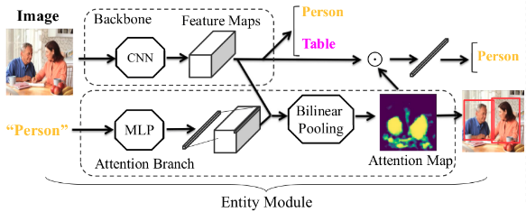
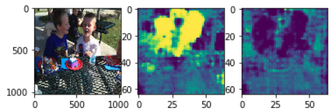

# Visual Cues Grounding Through Weak Suppervision

<i>PyTorch</i> implementation of **[Modularized Textual Grounding for Counterfactual Resilience
](http://openaccess.thecvf.com/content_CVPR_2019/papers/Fang_Modularized_Textual_Grounding_for_Counterfactual_Resilience_CVPR_2019_paper.pdf)** , CVPR 2019.

## Introduction
We propose a cross-modal grounding method through weak supervision.

A demonstration on how to load and ground the attribute can be found at : Demo.ipynb

Image -->  <em>'Boy'</em> Attribute -- > <em>'Lady'</em> Attribute

  

## Usage
Training script for attribute grounding: <pre>Train_attr_attention_embedding.py</pre>

Attention model for attribute grounding, it's based on a pre-trained Res-50 Network on person gender/age classification network:
<pre> /Models/Model7.py</pre>

\<lib> Contains all the neccesary dependencies for our framework, it consists of:

<ul>
  <li>bilinear pooling module: Implemented from <a href="https://github.com/DeepInsight-PCALab/CompactBilinearPooling-Pytorch">Compact Bilinear Pooling</a>. Faster Fourier Transform module is needed before using. Download and install it from <a href="https://github.com/DeepInsight-PCALab/CompactBilinearPooling-Pytorch">here</a> by running:
 <pre>pip3 install pytorch_fft</pre>
</li>
  <li>resnet: We modified the last fully connected layer from 2048d to 256d to a more compact representation.</li>
  <li>nms/roi_align module: Not neccesary in this time. (For entity grounding and bbox detection.)</li>
</ul></pre>

In order to re_train our framework, several things might be modified:
<pre> parser.py /<pre>

In parser.py, img_path/annotations need to be changed to your local coco_2017_train directory:
<pre> /path/to/your/local/coco17/image path/annotations/ </pre>

Argument resume is for loading pre-trained overall model.

## Download:
To download the pre-trained unsupervised network:
  <ul>
    <li><a href="https://drive.google.com/open?id=10syFqPtkUp4frDV6YEQbgbKs9dUdfTB_">Res50</a> can be found it here.</li>
    <li><a href="https://drive.google.com/open?id=1YPkw0n-beGZ1HTCxxroQTMa21nvg613p"> Model 7 in here</a>.</li>
  </ul>

